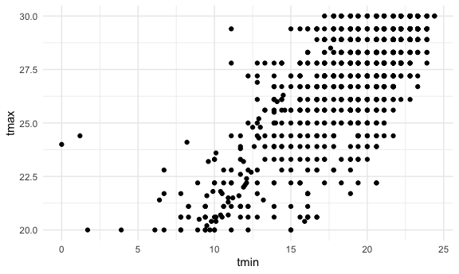

EDA
================
2025-10-02

``` r
library(tidyverse)
```

    ## ── Attaching core tidyverse packages ──────────────────────── tidyverse 2.0.0 ──
    ## ✔ dplyr     1.1.4     ✔ readr     2.1.5
    ## ✔ forcats   1.0.0     ✔ stringr   1.5.1
    ## ✔ ggplot2   3.5.2     ✔ tibble    3.3.0
    ## ✔ lubridate 1.9.4     ✔ tidyr     1.3.1
    ## ✔ purrr     1.1.0     
    ## ── Conflicts ────────────────────────────────────────── tidyverse_conflicts() ──
    ## ✖ dplyr::filter() masks stats::filter()
    ## ✖ dplyr::lag()    masks stats::lag()
    ## ℹ Use the conflicted package (<http://conflicted.r-lib.org/>) to force all conflicts to become errors

``` r
library(p8105.datasets)

knitr::opts_chunk$set(
  fig.width = 6,
  fig.asp = .6,
  out.width = "90%"
)

theme_set(theme_minimal() + theme(legend.position = "bottom"))

options(
  ggplot2.continuous.colour = "viridis",
  ggplot2.continuous.fill = "viridis"
)

scale_colour_discrete = scale_colour_viridis_d
scale_fill_discrete = scale_fill_viridis_d
```

import the weather data note:
`mutate(month = floor_date(date, unit = "month"))` = creates a new
variable called `month` and variable is a rounded version of the `date`
variable.

``` r
data("weather_df")

weather_df = weather_df %>% 
  mutate(month = floor_date(date, unit = "month"))
```

``` r
weather_df %>% 
  ggplot(aes(x = prcp)) +
  geom_histogram()
```

    ## `stat_bin()` using `bins = 30`. Pick better value with `binwidth`.

    ## Warning: Removed 15 rows containing non-finite outside the scale range
    ## (`stat_bin()`).


check on extreme values - you can even research why you are seeing those
values on google

``` r
weather_df %>% 
  filter(prcp > 1000)
```

    ## # A tibble: 3 × 7
    ##   name           id          date        prcp  tmax  tmin month     
    ##   <chr>          <chr>       <date>     <dbl> <dbl> <dbl> <date>    
    ## 1 CentralPark_NY USW00094728 2021-08-21  1130  27.8  22.8 2021-08-01
    ## 2 CentralPark_NY USW00094728 2021-09-01  1811  25.6  17.2 2021-09-01
    ## 3 Molokai_HI     USW00022534 2022-12-18  1120  23.3  18.9 2022-12-01

look at data again

``` r
weather_df %>% 
  filter(tmax >= 20, tmax <= 30) %>% 
  ggplot(aes(x = tmin, y = tmax), color = name, shape = name) +
  geom_point()
```



``` r
weather_df %>% 
  group_by(month)
```

    ## # A tibble: 2,190 × 7
    ## # Groups:   month [24]
    ##    name           id          date        prcp  tmax  tmin month     
    ##    <chr>          <chr>       <date>     <dbl> <dbl> <dbl> <date>    
    ##  1 CentralPark_NY USW00094728 2021-01-01   157   4.4   0.6 2021-01-01
    ##  2 CentralPark_NY USW00094728 2021-01-02    13  10.6   2.2 2021-01-01
    ##  3 CentralPark_NY USW00094728 2021-01-03    56   3.3   1.1 2021-01-01
    ##  4 CentralPark_NY USW00094728 2021-01-04     5   6.1   1.7 2021-01-01
    ##  5 CentralPark_NY USW00094728 2021-01-05     0   5.6   2.2 2021-01-01
    ##  6 CentralPark_NY USW00094728 2021-01-06     0   5     1.1 2021-01-01
    ##  7 CentralPark_NY USW00094728 2021-01-07     0   5    -1   2021-01-01
    ##  8 CentralPark_NY USW00094728 2021-01-08     0   2.8  -2.7 2021-01-01
    ##  9 CentralPark_NY USW00094728 2021-01-09     0   2.8  -4.3 2021-01-01
    ## 10 CentralPark_NY USW00094728 2021-01-10     0   5    -1.6 2021-01-01
    ## # ℹ 2,180 more rows

group and count things

``` r
weather_df %>% 
  group_by(name) %>% 
  summarize(
    n = n()
  )
```

    ## # A tibble: 3 × 2
    ##   name               n
    ##   <chr>          <int>
    ## 1 CentralPark_NY   730
    ## 2 Molokai_HI       730
    ## 3 Waterhole_WA     730

``` r
weather_df %>% 
  group_by(month) %>% 
  summarize(
    n = n()
  )
```

    ## # A tibble: 24 × 2
    ##    month          n
    ##    <date>     <int>
    ##  1 2021-01-01    93
    ##  2 2021-02-01    84
    ##  3 2021-03-01    93
    ##  4 2021-04-01    90
    ##  5 2021-05-01    93
    ##  6 2021-06-01    90
    ##  7 2021-07-01    93
    ##  8 2021-08-01    93
    ##  9 2021-09-01    90
    ## 10 2021-10-01    93
    ## # ℹ 14 more rows

``` r
weather_df %>% 
  group_by(month) %>% 
  summarize(
    n = n_distinct(date)
  )
```

    ## # A tibble: 24 × 2
    ##    month          n
    ##    <date>     <int>
    ##  1 2021-01-01    31
    ##  2 2021-02-01    28
    ##  3 2021-03-01    31
    ##  4 2021-04-01    30
    ##  5 2021-05-01    31
    ##  6 2021-06-01    30
    ##  7 2021-07-01    31
    ##  8 2021-08-01    31
    ##  9 2021-09-01    30
    ## 10 2021-10-01    31
    ## # ℹ 14 more rows

you can count directly

``` r
weather_df %>% 
  count(name)
```

    ## # A tibble: 3 × 2
    ##   name               n
    ##   <chr>          <int>
    ## 1 CentralPark_NY   730
    ## 2 Molokai_HI       730
    ## 3 Waterhole_WA     730

``` r
weather_df %>% 
  group_by(month) %>% 
  summarize(
    mean_tmax = mean(tmax, na.rm = TRUE),
    median_min = median(tmin, na.rm = TRUE),
    sd_prcp = sd(prcp, na.rm = TRUE)
  )
```

    ## # A tibble: 24 × 4
    ##    month      mean_tmax median_min sd_prcp
    ##    <date>         <dbl>      <dbl>   <dbl>
    ##  1 2021-01-01     10.9        0.6    113. 
    ##  2 2021-02-01      9.82      -1.65    83.4
    ##  3 2021-03-01     13.7        5      107. 
    ##  4 2021-04-01     16.8        8.05    37.0
    ##  5 2021-05-01     19.6       11.1     48.1
    ##  6 2021-06-01     24.3       17.8     38.6
    ##  7 2021-07-01     25.2       21.1     96.6
    ##  8 2021-08-01     25.2       21.1    141. 
    ##  9 2021-09-01     22.4       17.5    200. 
    ## 10 2021-10-01     18.2       13.9    112. 
    ## # ℹ 14 more rows
