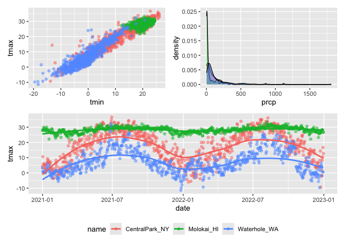
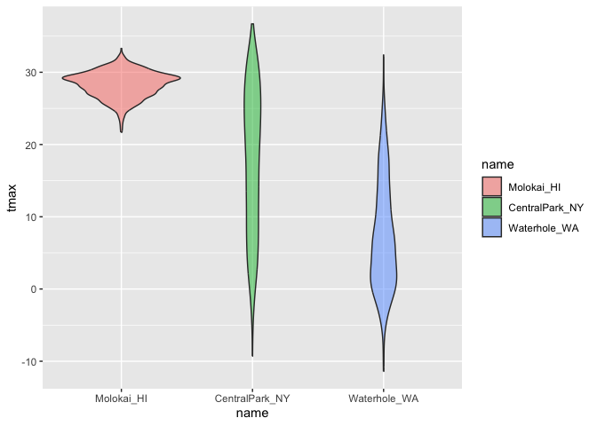

visualization_2
================
2025-09-30

``` r
library(tidyverse)
```

    ## ── Attaching core tidyverse packages ──────────────────────── tidyverse 2.0.0 ──
    ## ✔ dplyr     1.1.4     ✔ readr     2.1.5
    ## ✔ forcats   1.0.0     ✔ stringr   1.5.1
    ## ✔ ggplot2   3.5.2     ✔ tibble    3.3.0
    ## ✔ lubridate 1.9.4     ✔ tidyr     1.3.1
    ## ✔ purrr     1.1.0     
    ## ── Conflicts ────────────────────────────────────────── tidyverse_conflicts() ──
    ## ✖ dplyr::filter() masks stats::filter()
    ## ✖ dplyr::lag()    masks stats::lag()
    ## ℹ Use the conflicted package (<http://conflicted.r-lib.org/>) to force all conflicts to become errors

``` r
library(patchwork)
library(p8105.datasets)
```

import the weather data

``` r
data("weather_df")
```

let’s make our basic scatterplot note: `labs` function to add
descriptions to your plot

``` r
weather_df %>% 
  ggplot(aes(x = tmin, y=tmax)) +
  geom_point(aes(color = name), alpha = 0.5) +
  labs(
    x = "Minimum daily temp",
    y = "Maximum daily temp",
    title = "Temp scatterplot",
    caption = "Data from NOAA",
    color = "Location"
  )
```

    ## Warning: Removed 17 rows containing missing values or values outside the scale range
    ## (`geom_point()`).

<!-- -->

## Scales

``` r
weather_df %>% 
  ggplot(aes(x = tmin, y=tmax)) +
  geom_point(aes(color = name), alpha = 0.5) +
  labs(
    x = "Minimum daily temp",
    y = "Maximum daily temp",
    title = "Temp scatterplot",
    caption = "Data from NOAA",
    color = "Location"
  ) +
  scale_x_continuous(
    breaks = c(-20, 0, 25),
    labels = c("-20C", "0", "25")
  ) +
  scale_y_continuous(
    trans = "sqrt",
    limits = c(10,30)
  )
```

    ## Warning in transformation$transform(x): NaNs produced

    ## Warning in scale_y_continuous(trans = "sqrt", limits = c(10, 30)): sqrt
    ## transformation introduced infinite values.

    ## Warning: Removed 843 rows containing missing values or values outside the scale range
    ## (`geom_point()`).

<!-- -->

another way to zoom in to an area of your plot…

``` r
weather_df %>%
  filter(tmax > 10, tmax <30) %>% 
  ggplot(aes(x = tmin, y=tmax)) +
  geom_point(aes(color = name), alpha = 0.5) +
  labs(
    x = "Minimum daily temp",
    y = "Maximum daily temp",
    title = "Temp scatterplot",
    caption = "Data from NOAA",
    color = "Location"
  ) +
  scale_x_continuous(
    breaks = c(-20, 0, 25),
    labels = c("-20C", "0", "25")
  )  
```

<!-- -->

``` r
weather_df %>% 
  ggplot(aes(x = tmin, y=tmax)) +
  geom_point(aes(color = name), alpha = 0.5) +
  labs(
    x = "Minimum daily temp",
    y = "Maximum daily temp",
    title = "Temp scatterplot",
    caption = "Data from NOAA",
    color = "Location"
  ) +
  scale_x_continuous(
    breaks = c(-20, 0, 25),
    labels = c("-20C", "0", "25")
  ) +
  viridis::scale_color_viridis(
    discrete = TRUE
  )
```

    ## Warning: Removed 17 rows containing missing values or values outside the scale range
    ## (`geom_point()`).

<!-- -->

## Themes

make my base plot.

``` r
ggplot_temp = 
  weather_df %>% 
  ggplot(aes(x = tmin, y=tmax)) +
  geom_point(aes(color = name), alpha = 0.5) +
  labs(
    x = "Minimum daily temp",
    y = "Maximum daily temp",
    title = "Temp scatterplot",
    caption = "Data from NOAA",
    color = "Location"
  ) +
  scale_x_continuous(
    breaks = c(-20, 0, 25),
    labels = c("-20C", "0", "25")
  ) +
  viridis::scale_color_viridis(
    discrete = TRUE
  )
```

update my base plot note: order of code matters here

``` r
ggplot_temp +
  theme_dark() +
  theme(legend.position = "bottom") 
```

    ## Warning: Removed 17 rows containing missing values or values outside the scale range
    ## (`geom_point()`).

<!-- -->

``` r
ggplot_temp +
  theme_minimal() +
  theme(legend.position = "bottom") 
```

    ## Warning: Removed 17 rows containing missing values or values outside the scale range
    ## (`geom_point()`).

<!-- -->

``` r
ggplot_temp +
  theme_bw() +
  theme(legend.position = "bottom") 
```

    ## Warning: Removed 17 rows containing missing values or values outside the scale range
    ## (`geom_point()`).

<!-- -->

``` r
ggsave("weather_scatterplot.png", ggplot_temp)
```

    ## Saving 7 x 5 in image

    ## Warning: Removed 17 rows containing missing values or values outside the scale range
    ## (`geom_point()`).

## Adding data in geoms

overlapping two different data sets

``` r
central_park_df = 
  weather_df %>% 
  filter(name == "CentralPark_NY")

molokai_df =
 weather_df %>% 
  filter(name == "Molokai_HI")

ggplot(data = molokai_df, aes(x = date, y = tmax, color = name)) +
  geom_point() +
  geom_line(data = central_park_df)
```

    ## Warning: Removed 1 row containing missing values or values outside the scale range
    ## (`geom_point()`).

<!-- -->

## `pathwork`

making three plots and combining them (aka putting them side by side)
using `patchwork`

``` r
ggplot_tmax_tmin =
  weather_df %>% 
  ggplot(aes(x = tmin, y = tmax, color = name)) +
  geom_point(alpha = 0.5) +
  theme(legend.position = "none")

ggplot_prec_density =
  weather_df %>% 
  filter(prcp > 0) %>% 
  ggplot(aes(x = prcp, fill = name)) +
  geom_density(alpha = 0.5) +
  theme(legend.position = "none")

ggplot_temp_season =
  weather_df %>% 
  ggplot(aes(x = date, y = tmax, color = name)) +
  geom_point(alpha = 0.5) + 
  geom_smooth(se = FALSE) +
  theme(legend.position = "bottom")

(ggplot_tmax_tmin + ggplot_prec_density) / ggplot_temp_season
```

    ## Warning: Removed 17 rows containing missing values or values outside the scale range
    ## (`geom_point()`).

    ## `geom_smooth()` using method = 'loess' and formula = 'y ~ x'

    ## Warning: Removed 17 rows containing non-finite outside the scale range
    ## (`stat_smooth()`).
    ## Removed 17 rows containing missing values or values outside the scale range
    ## (`geom_point()`).

<!-- -->

## Data manipulation

let’s make temp. violin plots. note: using
`mutate(name = fct_relevel(name, c("Molokai_HI", "CentralPark_NY", "Waterhole, WA")))`
I’m putting Molokai_HI 1st, CentralPark_NY 2nd, and Waterhole, WA 3rd

``` r
weather_df %>% 
  mutate(name = fct_relevel(name, c("Molokai_HI", "CentralPark_NY", "Waterhole, WA"))) %>% 
  ggplot(aes(x = name, y = tmax, fill = name)) +
  geom_violin(alpha = 0.5)
```

    ## Warning: There was 1 warning in `mutate()`.
    ## ℹ In argument: `name = fct_relevel(name, c("Molokai_HI", "CentralPark_NY",
    ##   "Waterhole, WA"))`.
    ## Caused by warning:
    ## ! 1 unknown level in `f`: Waterhole, WA

    ## Warning: Removed 17 rows containing non-finite outside the scale range
    ## (`stat_ydensity()`).

<!-- -->

another way to do this

``` r
weather_df %>% 
  mutate(name = fct_reorder(name, tmax)) %>% 
  ggplot(aes(x = name, y = tmax, fill = name)) +
  geom_violin(alpha = 0.5)
```

    ## Warning: There was 1 warning in `mutate()`.
    ## ℹ In argument: `name = fct_reorder(name, tmax)`.
    ## Caused by warning:
    ## ! `fct_reorder()` removing 17 missing values.
    ## ℹ Use `.na_rm = TRUE` to silence this message.
    ## ℹ Use `.na_rm = FALSE` to preserve NAs.

    ## Warning: Removed 17 rows containing non-finite outside the scale range
    ## (`stat_ydensity()`).

<!-- -->

what about data tidiness??

note: `mutate(vist = fct_inorder(visit))` = what order does it appear in
the first dataset we started with

``` r
pulse_df = 
  haven::read_sas("data/public_pulse_data.sas7bdat") %>% 
  janitor:: clean_names() %>% 
  pivot_longer(
    cols = bdi_score_bl:bdi_score_12m,
    names_to = "visit",
    names_prefix = "bdi_score_",
    values_to = "bdi"
  ) %>% 
  mutate(vist = fct_inorder(visit))

pulse_df %>% 
  ggplot(aes(x = visit, y = bdi)) +
  geom_boxplot()
```

    ## Warning: Removed 879 rows containing non-finite outside the scale range
    ## (`stat_boxplot()`).

<!-- -->

Make a plot for the FAS study.

``` r
pups_df = 
  read_csv("data/FAS_pups.csv", na = c("NA", ".", ""), skip = 3) %>% 
  janitor::clean_names() %>% 
  mutate(
    sex = case_match(
      sex,
      1 ~ "male",
      2 ~ "female"
    )
  )
```

    ## Rows: 313 Columns: 6
    ## ── Column specification ────────────────────────────────────────────────────────
    ## Delimiter: ","
    ## chr (1): Litter Number
    ## dbl (5): Sex, PD ears, PD eyes, PD pivot, PD walk
    ## 
    ## ℹ Use `spec()` to retrieve the full column specification for this data.
    ## ℹ Specify the column types or set `show_col_types = FALSE` to quiet this message.

``` r
litters_df =
  read_csv("data/FAS_litters.csv", na = c("NA", ".", "")) %>% 
  janitor::clean_names() %>%  
  separate(group, into = c("dose", "tx_day", sep = 3))
```

    ## Rows: 49 Columns: 8
    ## ── Column specification ────────────────────────────────────────────────────────
    ## Delimiter: ","
    ## chr (2): Group, Litter Number
    ## dbl (6): GD0 weight, GD18 weight, GD of Birth, Pups born alive, Pups dead @ ...
    ## 
    ## ℹ Use `spec()` to retrieve the full column specification for this data.
    ## ℹ Specify the column types or set `show_col_types = FALSE` to quiet this message.

    ## Warning: Expected 3 pieces. Missing pieces filled with `NA` in 49 rows [1, 2, 3, 4, 5,
    ## 6, 7, 8, 9, 10, 11, 12, 13, 14, 15, 16, 17, 18, 19, 20, ...].

``` r
fas_df = 
  left_join(pups_df, litters_df, by = "litter_number")

fas_df %>% 
  select(pd_ears:tx_day) %>% 
  pivot_longer(
    cols = pd_ears:pd_walk,
    names_to = "outcome",
    names_prefix = "pd_",
    values_to = "pn_day") %>% 
  mutate(outocme = fct_reorder(outcome, pn_day)) %>%
  ggplot(aes(x = dose, y = pn_day)) +
  geom_violin() +
  facet_grid(tx_day ~ outcome)
```

    ## Warning: There was 1 warning in `mutate()`.
    ## ℹ In argument: `outocme = fct_reorder(outcome, pn_day)`.
    ## Caused by warning:
    ## ! `fct_reorder()` removing 44 missing values.
    ## ℹ Use `.na_rm = TRUE` to silence this message.
    ## ℹ Use `.na_rm = FALSE` to preserve NAs.

    ## Warning: Removed 44 rows containing non-finite outside the scale range
    ## (`stat_ydensity()`).

<!-- -->
